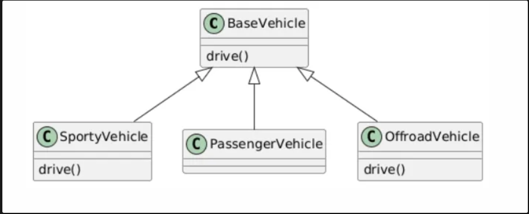
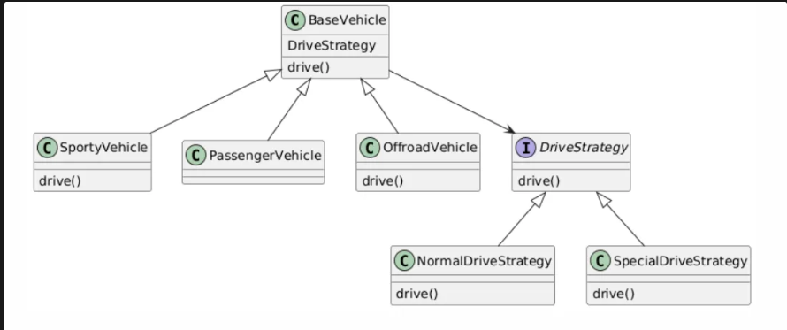

## Strategy Design Pattern

Consider a case where we have a base class of `Vehicle` and 3 child classes which extend the base class with `SportyVehicle` , `PassengerVehicle`, `OffroadVehicle`

Here the `SportyVehicle` and `OffroadVehicle` override the `BaseVehicles` code by adding same logic in both classes.

This leads to same logic present in 2 separate child classes and hence code duplication

To solve this, we create an interface for drive strategy called `DriveStrategy`

This interface is implemented by all possible strategies - `Normal` and `Special` in our example

And this interface is an attribute to the `BaseVehicle` class.

Now whenever we are using SportyVehicle we set the DriveStrategy as SpecialDriveStrategy in the constructor. Same way we can do for other vehicle classes.